# Project 3, Milestone 1: Design Journey

[← Table of Contents](design-journey.md)


> **Replace ALL _TODOs_ with your work.** (There should be no TODOs in the final submission.)
>
> Be clear and concise in your writing. Bullets points are encouraged.
>
> Place all design journey images inside the "design-plan" folder and then link them in Markdown so that they are visible in Markdown Preview.
>
> **Everything, including images, must be visible in _Markdown: Open Preview_.** If it's not visible in the Markdown preview, then we can't grade it. We also can't give you partial credit either. **Please make sure your design journey should is easy to read for the grader;** in Markdown preview the question _and_ answer should have a blank line between them.


## Project
> Which project will you add interactivity to enhance the site's functionality?

Project 2


## Audience's Goals
> List the audience's goals that you identified in Project 1 or 2.
> Simply list each goal. No need to include the "Design Ideas and Choices", etc.
> You may adjust the goals if necessary.

- To know information about the vendors and food at the event, as that is the main reason they attend (for the food)
- To know about the 'must try' places, as often they go for the 'Ithaca' expeirence and would like guidance on the best stalls to go to
- Help navigating (map) so they can easily find their way through Apple Fest.


## Modal Interactivity Brainstorm
> Using the audience goals you identified, brainstorm possible options for **modal** interactivity to enhance the functionality of the site while also assisting the audience with their goals.
> Briefly explain each idea and provide a brief rationale for how the interactivity enhances the site's functionality for the audience. (1 sentence)
> Note: You may find it easier to sketch for brainstorming. That's fine too. Do whatever you need to do to explore your ideas.

- On the map page, the user can click on the map to get an enlarged picture of it. This way they can clearly see the map as they navigate through Apple Fest. Enlarging the map helps with acccessibility as if a user has trouble viewing a small image, the enlarged view with help them get a clearer picture.
- On food page users can click a 'must try' button that opens a modal featuring popular stalls, vendor food highlights. This helps users easily click into the 'Must Try' to help them plan which stalls they would like to visit before they go.
- On the Food and Crafts page, users can click into a button called 'Vendor List' which opens a modal with a list containing all of the participating vendors. This helps the functionality of the site as it does not overwhelem the user with the whole list unless they click into it.

## Interactivity Design Ideation
> Explore the possible design solutions for the interactivity.
> Sketch at least two iterations of the modal and at least two iterations of the hamburger menu interactivity.
> Annotate each sketch explaining what happens when a user takes an action. (e.g. When user clicks this, something else appears.)
> Do not include HTML/CSS annotations in your sketches!

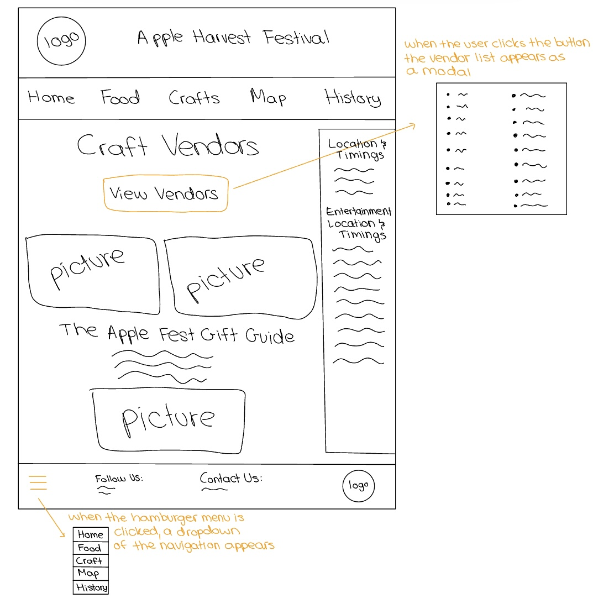
This sketch contains 1 iteration of a modal (Vendor List) and 1 iteration of a hamburger menu (in footer)

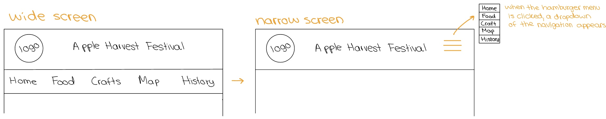
This sketch contains the second iteration of the hamburger menu (in the header when the browser size is resized)

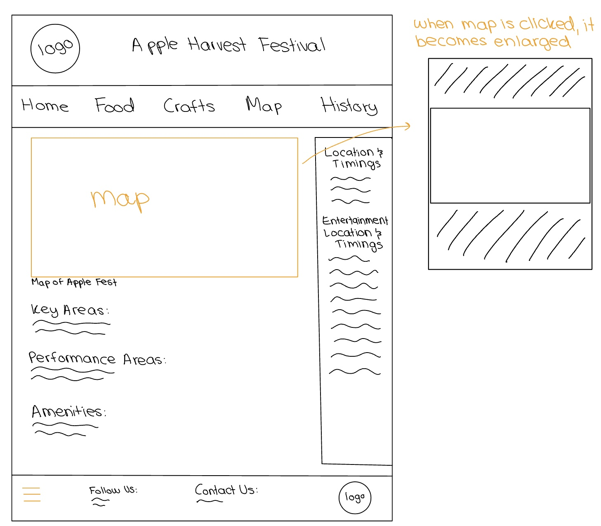
This sketch contains the second iteration of a modal (image of map expandanding when user clicks on it)

## Final Interactivity Design Sketches
> Create _polished_ design sketch(es) (it's still a sketch, but with a little more care taken to communicate ideas clearly to the graders) to plan your interactivity.
> **Sketch out the entire page where your interactivity will go.**
> Include your interactivity to the sketch(es).
> Add annotations to explain what happens when the user takes an action.
> Include as many sketches as necessary to communicate your design (ask yourself, could another 1300 take these sketches an implement my design?)

**Modal design sketches:**

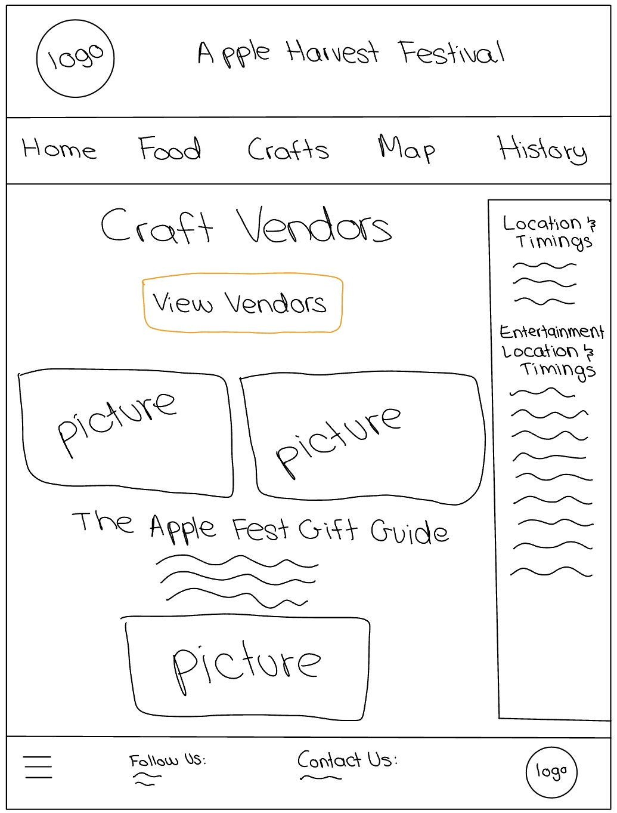
On Crafts page, users click the View Vendors button which will be orange (same as theme of website)

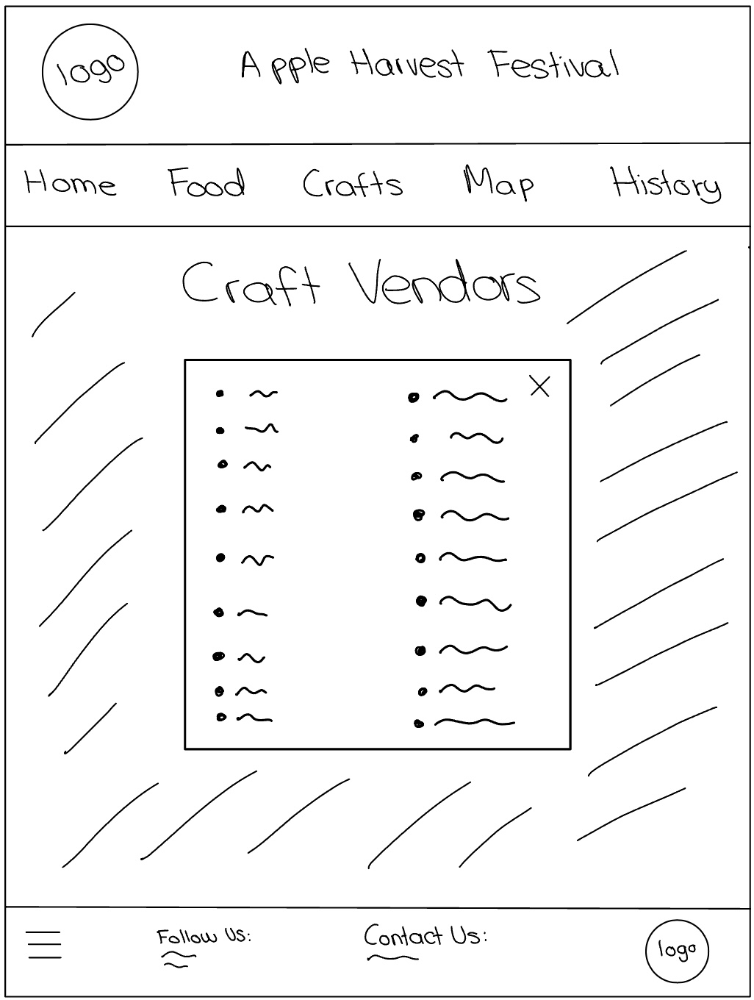
Crafts page after users click the View Vendors button where a modal of the list of vendors pops up, while other content is blurred.

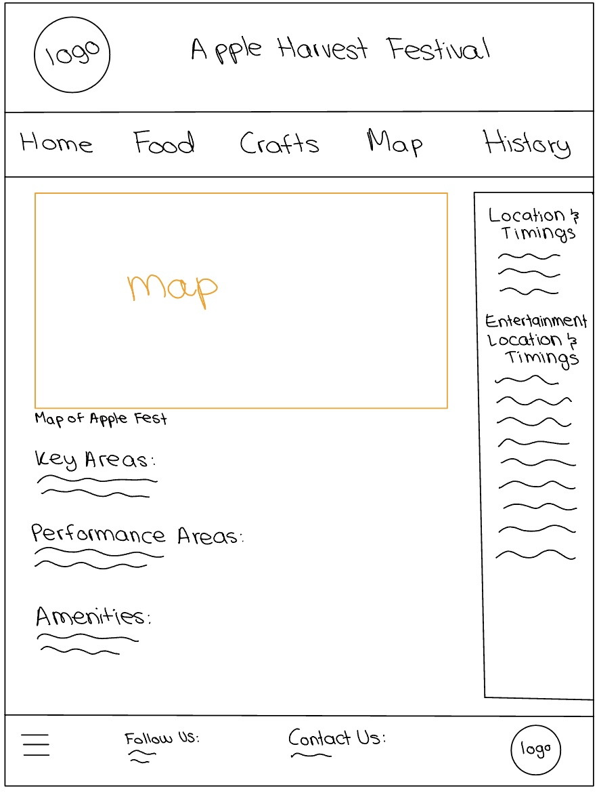
Map page: users click onto the map

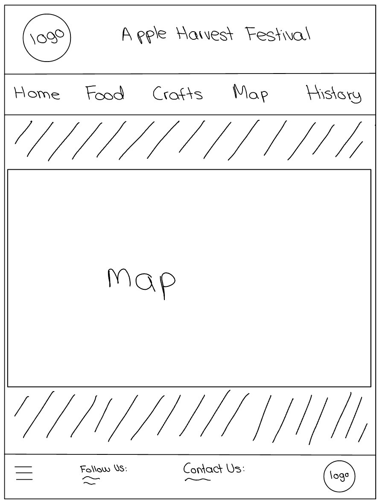
After users click on the map it expands and takes up the whole page while other content is blurred behind

**Hamburger drop-down navigation menu design sketches:**

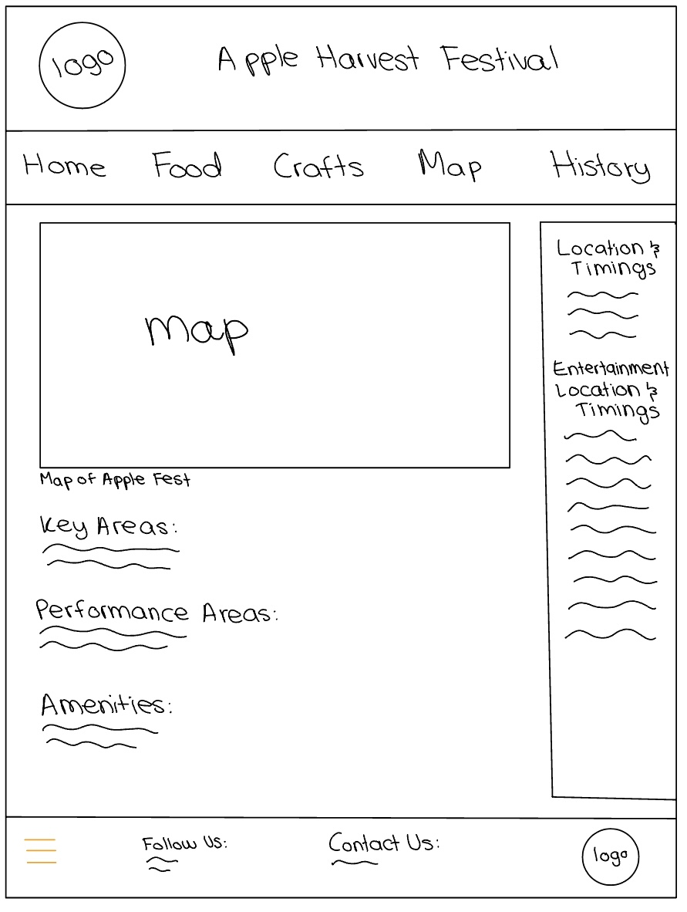
Wide version of browser with normal navigation menu, menu in footer is a hamburger drop down menu regardless of sizing

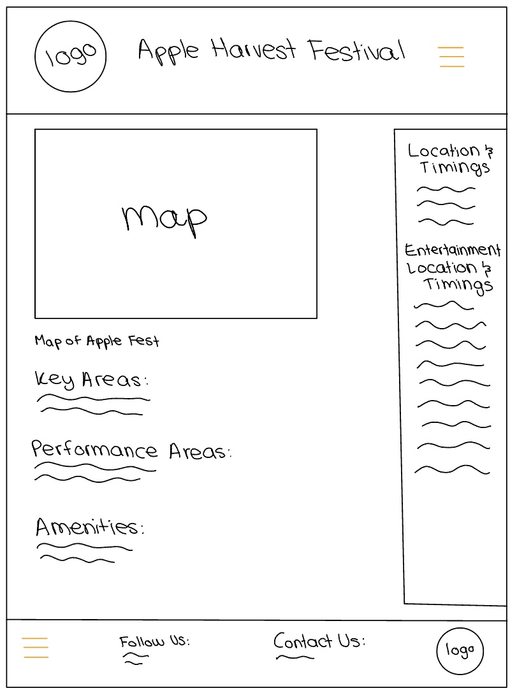
Narrow version of browser: header navigation turns into a hamburger drop down

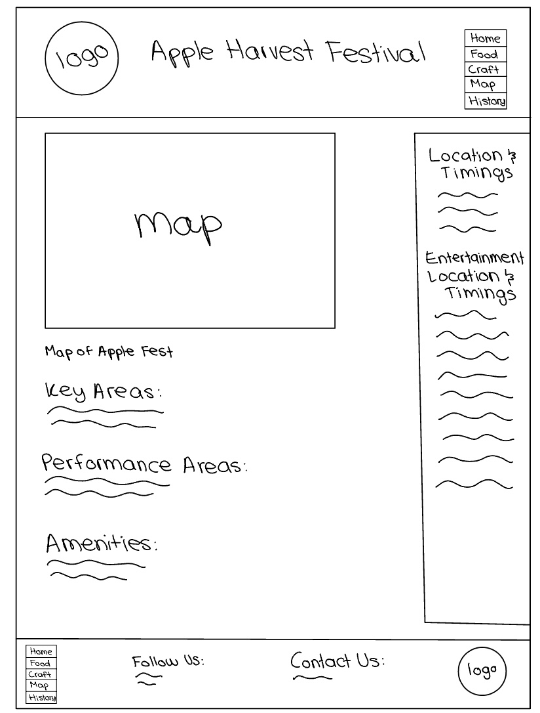
Example of drop down toggle menu when clicked by user

## Interactivity Rationale
> Describe the purpose of your proposed interactivity.
> Provide a brief rationale explaining how your proposed interactivity addresses the goals of your site's audience.
> This should be about a paragraph. (2-3 sentences)

My proposed interactivity for the map helps users easily see all the details and information on the map which multiple interviewees mentioned was something they would find useful as it would help them navigate. Also allowing the figure of the map to expand helps with accessibility issues as people with struggles of reading small details will find the larger version helpful. My proposed interactivity for the vendor list helps make the Crafts page more digestable for users as in the previous version the list of vendors is very long but this gives users the options of clicking in to see the list when they would like but so it does not clutter the page (as in the interviews users seemed more interested in what they could buy as gifts which is a section at the bottom of the crafts page, and indicated pictures would be helpful). Lastly, the hamburger menu optimizes screen layout on narrower browsers which allows navigation without cluttering the page.


## Interactivity Planning Sketches
> Produce planning sketches that include all the details another 1300 student would need to implement your interactivity design.
> Your planning sketches should include _all_ HTML elements needed for the interactivity; _annotations_ for the element types, their unique IDs, and CSS classes; and lastly the initial CSS classes.
> This is asking you to create a planning sketch like the one we did during the in-class activity.

**Modal planning sketches:**

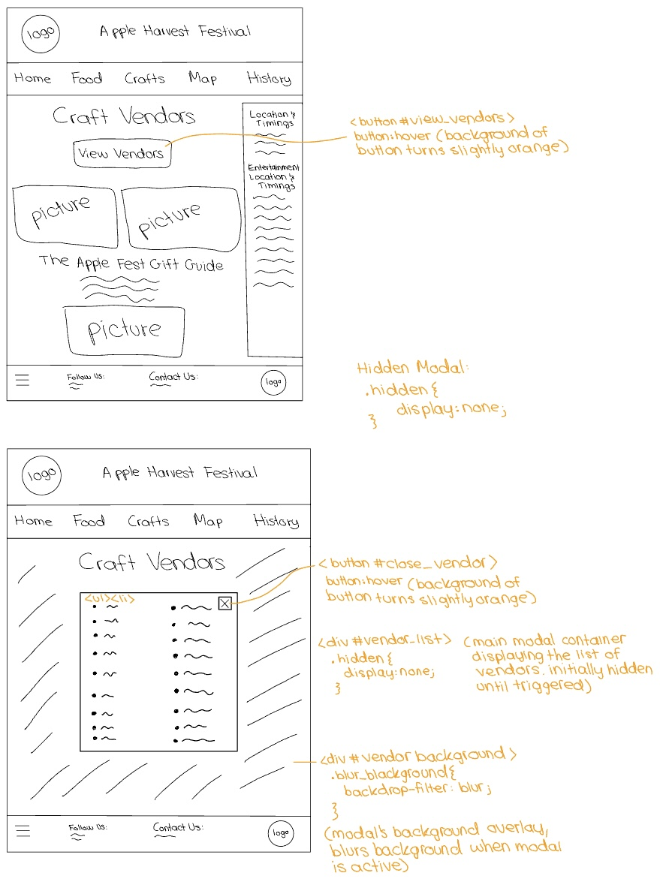

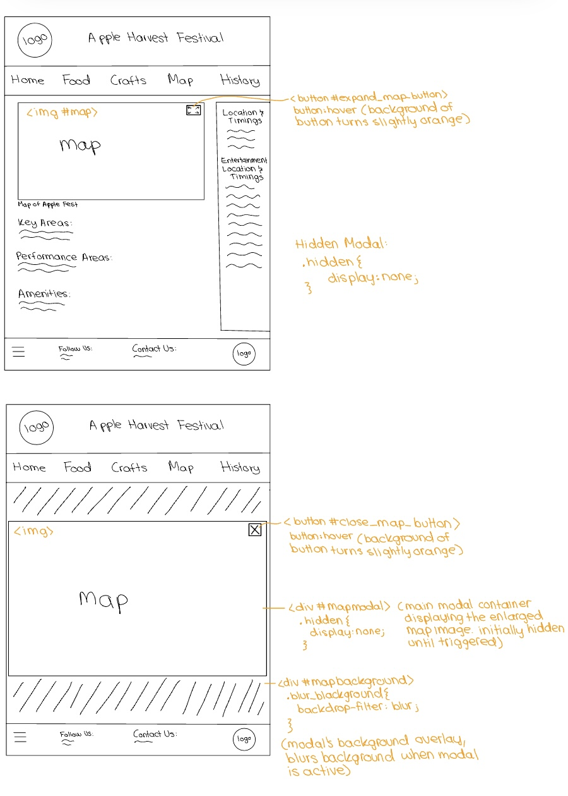

**Hamburger drop-down navigation menu planning sketches:**

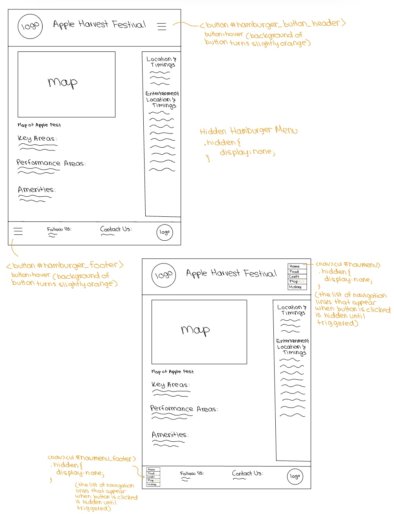


## Interactivity Pseudocode Plan
> Write your interactivity pseudocode plan here.
> Pseudocode is not JavaScript. Do not put JavaScript code here.

**Modal pseudocode:**

> Pseudocode to open the map modal:

```
When user clicks on expand_map_button:
  Remove hidden class from mapbackground
  Remove hidden class from mapmodal
```

> Pseudocode to open the vendor modal:

```
When user clicks on view_vendors button:
  Remove hidden class from vendorbackground
  Remove hidden class from vendors_list
```

> Pseudocode to close the map modal:

```
When user clicks on close_map_button:
  Add hidden class to mapbackground
  Add hidden class to mapmodal
```

> Pseudocode to close the vendor modal:

```
When user clicks on close_vendor button:
  Add hidden class to vendorbackground
  Add hidden class to vendors_list
```

**Hamburger menu pseudocode:**

> Pseudocode to show/hide (toggle) the navigation menu (narrow screens) when the hamburger button is clicked:

```
When header_hamburger_button is clicked:
  if the navigation menu is not visible:
    Remove hidden class from navmenu
  else:
    Add hidden class to navmenu
```

```
When footer_hamburger_button is clicked:
  if the navigation menu is not visible:
    Remove hidden class from navmenu_footer
  else:
    Add hidden class to navmenu_footer
```

> Media queries are prohibited to show/hide the hamburger menu for this assignment.
> (I want you to demonstrate the interactivity learning objectives we covered in class.)
> If the browser window is narrow when the page loads, the hamburger button should be visible and the navigation should be hidden.
> If the browser window is wide when the page loads, the hamburger menu should not be visible.
> Complete the pseudocode to show/hide (toggle) the navigation on page load:

```
on page load (ready):
  if window is narrow:
    Remove hidden class from hamburger button (header and footer)
    Add hidden class to navmenu and navmenu_footer
   else if window is wide:
     Add hidden class to hamburger button (header and footer)
     Remove hidden class from navmenu and navmenu_footer
```

> If the browser window is resized from wide to narrow, the hamburger menu should become visible and the navigation should be hidden.
> If the browser window is resized from narrow to wide, the hamburger menu should become hidden and the navigation should be visible.

```
on window resize:
  if window is narrow:
    Remove hidden class from hamburger button (header and footer)
    Add hidden class to navmenu and navmenu_footer
  else if window is wide:
    Add hidden class to hamburger button (header and footer)
    Remove hidden class from navmenu and navmenu_footer
```

## References

### Collaborators
> List any persons you collaborated with on this project.

No. Went to OH for help from TAs.


### Reference Resources
> Did you use any resources not provided by this class to help you complete this assignment?
> List any external resources you referenced in the creation of your project. (i.e. W3Schools, StackOverflow, Mozilla, etc.)
>
> List **all** resources you used (websites, articles, books, etc.), including generative AI.
> Provide the URL to the resources you used and include a short description of how you used each resource.

No


[← Table of Contents](design-journey.md)
